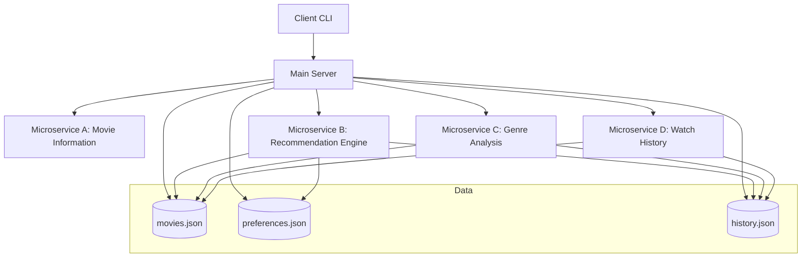
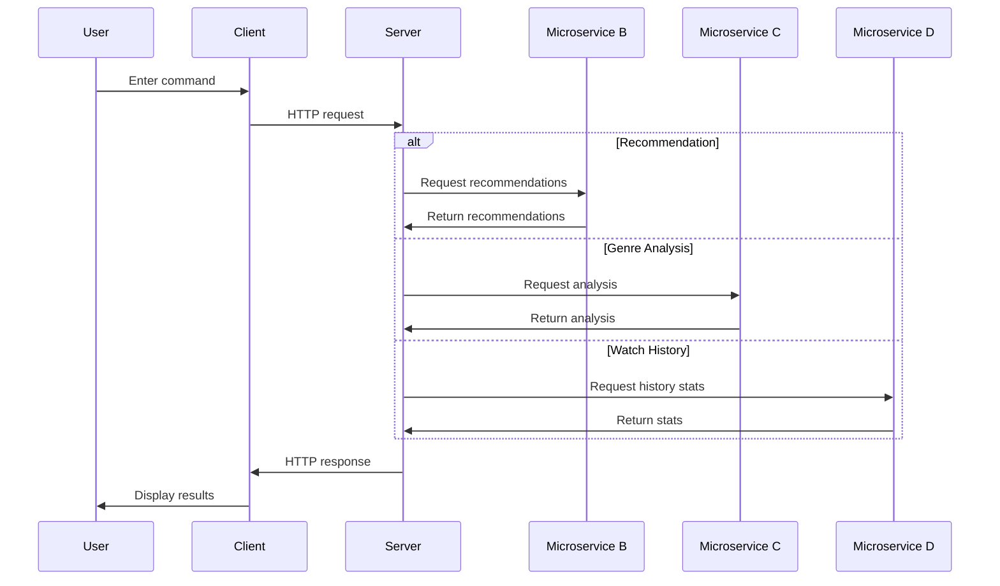

# System Patterns: Movie Recommendation System

## System Architecture

The Movie Recommendation System follows a microservices architecture with the following components:

### Component Responsibilities

1. **Client CLI (client.py)**:
   - Provides user interface via command-line
   - Handles command parsing and validation
   - Makes HTTP requests to the Main Server
   - Displays formatted results to the user

2. **Main Server (server.py)**:
   - Serves as the central API for the Client
   - Manages core data (movies, preferences, history)
   - Coordinates with microservices for specialized functionality
   - Handles data persistence via JSON files

3. **Microservice A: Movie Information** (from teammate):
   - Provides detailed movie information
   - Handles search functionality
   - Returns cast, crew, release dates, and ratings

4. **Microservice B: Recommendation Engine (service_b.py)**:
   - Processes user preferences
   - Generates personalized recommendations
   - Implements collaborative filtering
   - Provides relevance scoring and explanations

5. **Microservice C: Genre Analysis (service_c.py)**:
   - Categorizes movies by genre
   - Analyzes genre distribution and trends
   - Identifies popular genres
   - Provides decade-based genre analysis

6. **Microservice D: Watch History (service_d.py)**:
   - Tracks user viewing history
   - Analyzes watching patterns
   - Provides statistics and trends
   - Offers insights into viewing habits

## Key Technical Decisions

1. **Microservices Architecture**:
   - Each component runs as a separate process
   - Components communicate via REST APIs
   - No direct function calls between components
   - Clear separation of concerns

2. **Flask for Web Framework**:
   - Lightweight and easy to use
   - Built-in development server
   - Simple route handling
   - JSON support for API responses

3. **cmd Module for CLI**:
   - Built-in Python module for command-line interfaces
   - Provides command history and tab completion
   - Easy to extend with new commands
   - Consistent command structure

4. **JSON for Data Storage**:
   - Simple and human-readable format
   - Native Python support
   - Easy to modify and extend
   - No database setup required

5. **Requests for HTTP Client**:
   - Simple and intuitive API
   - Session support for connection pooling
   - JSON handling built-in
   - Comprehensive error handling

## Design Patterns in Use

1. **Command Pattern**:
   - Each CLI command is implemented as a separate method
   - Commands follow a consistent naming convention (do_*)
   - Commands handle their own parsing and validation
   - Help documentation is provided for each command

2. **Facade Pattern**:
   - Main Server provides a simplified interface to the underlying system
   - Client interacts with a single API endpoint for each operation
   - Complexity of microservices is hidden from the client

3. **Repository Pattern**:
   - Data access is abstracted through functions (read_json_file, write_json_file)
   - Business logic is separated from data access
   - Consistent error handling for data operations

4. **Observer Pattern**:
   - Changes to preferences affect recommendations
   - Changes to watch history affect statistics and trends
   - System responds to user actions with appropriate updates

5. **Strategy Pattern**:
   - Different recommendation strategies based on user preferences
   - Different analysis strategies for genres and history
   - Flexible and extensible approach to core functionality

## Component Relationships

### Data Flow

### Communication Protocols

1. **Client to Server**:
   - HTTP requests (GET, POST, DELETE)
   - JSON data format
   - RESTful API endpoints
   - Error handling with status codes

2. **Server to Microservices**:
   - HTTP requests (GET, POST)
   - JSON data format
   - Dedicated ports for each microservice
   - Health check endpoints

3. **Data Persistence**:
   - File I/O operations
   - JSON serialization/deserialization
   - Error handling for file operations
   - Atomic write operations where possible

## Error Handling Strategy

1. **Client-Side Errors**:
   - Input validation before sending requests
   - Clear error messages for invalid commands
   - Suggestions for recovery from errors
   - Connection error handling with retry logic

2. **Server-Side Errors**:
   - Comprehensive logging of all operations
   - Structured error responses with status codes
   - Graceful handling of missing or corrupt data
   - Default values for missing configuration

3. **Microservice Errors**:
   - Health check endpoints for service availability
   - Timeout handling for unresponsive services
   - Fallback behavior when services are unavailable
   - Detailed error logging for debugging

## Scalability Considerations

1. **Independent Scaling**:
   - Each microservice can be scaled independently
   - No shared state between components
   - Stateless communication via REST APIs
   - Clear interface boundaries

2. **Performance Optimization**:
   - Connection pooling for HTTP requests
   - Efficient data structures for in-memory operations
   - Minimal data transfer between components
   - Caching of frequently accessed data

3. **Future Extensions**:
   - Additional microservices can be added easily
   - Existing microservices can be enhanced independently
   - Client can be extended with new commands
   - Data model can be expanded with new fields
